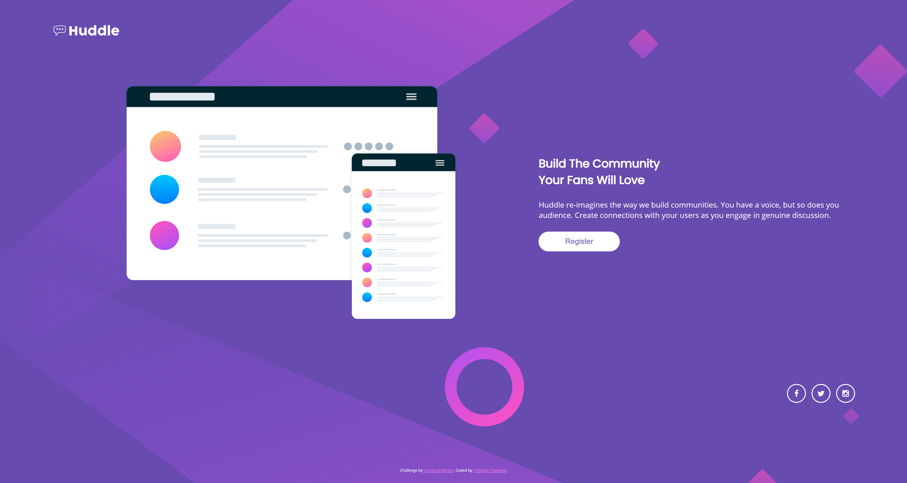

# Frontend Mentor - Huddle landing page with single introductory section solution

This is a solution to the [Huddle landing page with single introductory section challenge on Frontend Mentor](https://www.frontendmentor.io/challenges/huddle-landing-page-with-a-single-introductory-section-B_2Wvxgi0). Frontend Mentor challenges help you improve your coding skills by building realistic projects. 

## Table of contents

- [Overview](#overview)
  - [The challenge](#the-challenge)
  - [Screenshot](#screenshot)
  - [Links](#links)
- [My process](#my-process)
  - [Built with](#built-with)
  - [What I learned](#what-i-learned)
  - [Useful resources](#useful-resources)
- [Author](#author)
- [Acknowledgments](#acknowledgments)

## Overview

### The challenge

Users should be able to:

- View the optimal layout for the page depending on their device's screen size
- See hover states for all interactive elements on the page

### Screenshot




### Links
<!-- 
- Solution URL: [Add solution URL here](https://your-solution-url.com)
- Live Site URL: [Add live site URL here](https://your-live-site-url.com) 
-->

## My process

### Built with

- Flexbox
- CSS Grid
- Mobile-first workflow

### What I learned

```css 
global variable
:root {
    --color-white: #ffffff;
    --color-violet: hsl(257, 40%, 49%);
    --color-soft-magenta: hsl(300, 69%, 71%);
}
grid
.app {
    display: grid;
    grid-gap: 1em;
    grid-template-columns: 1fr;
    grid-auto-rows: auto;
    grid-template-areas: "header" "image" "article" "social" "footer";
}
```

### Useful resources

- [CSS Grid](https://css-tricks.com/snippets/css/complete-guide-grid/) - Grid properties

## Author

- Frontend Mentor - [@Krittakan](https://www.frontendmentor.io/profile/Krittakan)

## Acknowledgments

This challenge is good pratice for css grid and responsive design.
